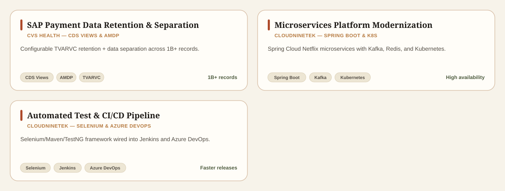

<picture>
  <source media="(prefers-color-scheme: dark)" srcset="assets/dark/hero.svg">
  <source media="(prefers-color-scheme: light)" srcset="assets/light/hero.svg">
  
</picture>

<picture>
  <source media="(prefers-color-scheme: dark)" srcset="assets/dark/typing.svg">
  <source media="(prefers-color-scheme: light)" srcset="assets/light/typing.svg">
  
</picture>

<picture>
  <source media="(prefers-color-scheme: dark)" srcset="assets/dark/divider.svg">
  <source media="(prefers-color-scheme: light)" srcset="assets/light/divider.svg">
  
</picture>

## About Me

I'm a backend software developer with 3+ years of experience building applications and services in **Python and Java**, with strong hands-on skills in **REST/OData API design, development, and testing**. I use Postman to validate and troubleshoot API endpoints, alongside SQL and relational/SAP HANA database integration.

My background also includes **SAP S/4HANA development** with Object-Oriented ABAP, CDS Views, RAP, BAPIs, BADIs, and RFCs. I'm comfortable across the full development lifecycle — coding, unit and API testing, code reviews, debugging, and production support within Agile teams.

- 🎓 M.S. Computer &amp; Information Science — University of Southern Mississippi (Dec 2023)
- 🎓 B.Sc. Computer Science, Mathematics &amp; Statistics — Acharya Nagarjuna University (2021)
- 💼 Currently: Python Developer at Tech Pro
- 🔬 Focus: backend development (Python, Java) · SAP S/4HANA &amp; ABAP · cloud-native systems
- 📍 Based in Bentonville, Arkansas, USA

<picture>
  <source media="(prefers-color-scheme: dark)" srcset="assets/dark/terminal.svg">
  <source media="(prefers-color-scheme: light)" srcset="assets/light/terminal.svg">
  
</picture>

<picture>
  <source media="(prefers-color-scheme: dark)" srcset="assets/dark/divider.svg">
  <source media="(prefers-color-scheme: light)" srcset="assets/light/divider.svg">
  
</picture>

## Skills

<picture>
  <source media="(prefers-color-scheme: dark)" srcset="assets/dark/skills.svg">
  <source media="(prefers-color-scheme: light)" srcset="assets/light/skills.svg">
  
</picture>

### Tech Stack

<picture>
  <source media="(prefers-color-scheme: dark)" srcset="assets/dark/divider.svg">
  <source media="(prefers-color-scheme: light)" srcset="assets/light/divider.svg">
  
</picture>

## Featured Projects

<picture>
  <source media="(prefers-color-scheme: dark)" srcset="assets/dark/projects.svg">
  <source media="(prefers-color-scheme: light)" srcset="assets/light/projects.svg">
  
</picture>

<picture>
  <source media="(prefers-color-scheme: dark)" srcset="assets/dark/divider.svg">
  <source media="(prefers-color-scheme: light)" srcset="assets/light/divider.svg">
  
</picture>

## GitHub Analytics

<picture>
  <source media="(prefers-color-scheme: dark)" srcset="https://github-readme-stats.vercel.app/api?username=dsaisantoshkumar&show_icons=true&hide_border=true&bg_color=1E1B16&title_color=E4793F&text_color=C8C0AF&icon_color=D8A165&border_color=383226">
  <source media="(prefers-color-scheme: light)" srcset="https://github-readme-stats.vercel.app/api?username=dsaisantoshkumar&show_icons=true&hide_border=true&bg_color=FFFDF8&title_color=AE4A2A&text_color=524C44&icon_color=B5793F&border_color=DCD0B8">
  
</picture>
<picture>
  <source media="(prefers-color-scheme: dark)" srcset="https://github-readme-stats.vercel.app/api/top-langs/?username=dsaisantoshkumar&layout=compact&hide_border=true&bg_color=1E1B16&title_color=E4793F&text_color=C8C0AF&border_color=383226">
  <source media="(prefers-color-scheme: light)" srcset="https://github-readme-stats.vercel.app/api/top-langs/?username=dsaisantoshkumar&layout=compact&hide_border=true&bg_color=FFFDF8&title_color=AE4A2A&text_color=524C44&border_color=DCD0B8">
  
</picture>

<picture>
  <source media="(prefers-color-scheme: dark)" srcset="https://streak-stats.demolab.com?user=dsaisantoshkumar&hide_border=true&background=1E1B16&ring=E4793F&fire=E4793F&currStreakLabel=D8A165&sideLabels=C8C0AF&currStreakNum=F3EEE3&sideNums=F3EEE3&dates=938A78&border=383226">
  <source media="(prefers-color-scheme: light)" srcset="https://streak-stats.demolab.com?user=dsaisantoshkumar&hide_border=true&background=FFFDF8&ring=AE4A2A&fire=AE4A2A&currStreakLabel=B5793F&sideLabels=524C44&currStreakNum=1B1815&sideNums=1B1815&dates=8A8272&border=DCD0B8">
  
</picture>

<picture>
  <source media="(prefers-color-scheme: dark)" srcset="https://github-readme-activity-graph.vercel.app/graph?username=dsaisantoshkumar&hide_border=true&bg_color=1E1B16&color=E4793F&line=E4793F&point=F3EEE3">
  <source media="(prefers-color-scheme: light)" srcset="https://github-readme-activity-graph.vercel.app/graph?username=dsaisantoshkumar&hide_border=true&bg_color=FFFDF8&color=AE4A2A&line=AE4A2A&point=1B1815">
  
</picture>

> These four widgets are rendered live by [github-readme-stats](https://github.com/anuraghazra/github-readme-stats) and [github-readme-activity-graph](https://github.com/Ashutosh00710/github-readme-activity-graph) — established open-source services, not static images — so the numbers you see always reflect the real, current state of this account.

<picture>
  <source media="(prefers-color-scheme: dark)" srcset="assets/dark/divider.svg">
  <source media="(prefers-color-scheme: light)" srcset="assets/light/divider.svg">
  
</picture>

## Experience

<picture>
  <source media="(prefers-color-scheme: dark)" srcset="assets/dark/timeline.svg">
  <source media="(prefers-color-scheme: light)" srcset="assets/light/timeline.svg">
  
</picture>

<strong>Python Developer · Tech Pro</strong>, NJ — Feb 2026 – Present

 

- Develop and maintain Python backend components and REST APIs that support application workflows and system integrations.
- Create automation scripts and data-processing utilities with validation, logging, and exception handling to improve consistency in recurring operational tasks.
- Implement database operations and write SQL queries for data retrieval, validation, reporting, and application updates.
- Write and execute unit and API test cases, including Postman-based validation of REST endpoints, to verify functionality before release.
- Investigate application defects and production incidents, identify root causes, and deliver targeted fixes and functional enhancements.
- Refactor shared modules into reusable functions and components to improve code readability, maintainability, and testability.
- Use Git within an Agile development process and participate in code reviews, testing, sprint activities, and release support.

<strong>SAP ABAP Developer, Contract · CVS Health</strong> — Jan 2025 – Jan 2026

 

<em>Employers of record: Signitives (Jan 2025 – Apr 2025) and 3A IT Solutions (Apr 2025 – Jan 2026)</em>

- Developed configurable data retention solutions using the TVARVC table to automate historical data cleanup based on business-defined retention policies.
- Resolved critical performance bottlenecks and system instability in high-volume payment processing systems containing over 1 billion records by implementing a scalable data separation strategy for reversal transactions.
- Designed and implemented custom staging tables to process hierarchical invoice and claim data before dynamically loading it into target tables for downstream processing.
- Developed advanced CDS Views with input parameters to support complex parent-child invoice relationships (PI, IC, IA, IB), enabling dynamic aggregation and real-time invoice reconciliation reporting.
- Built reusable and modular Object-Oriented ABAP applications using SE24 Class Builder, implementing exception handling, encapsulation, and reusable utility classes for high-volume enterprise operations.
- Developed HANA-optimized AMDP procedures and database-intensive business logic using code pushdown techniques, improving runtime performance and reducing SAP application server load.
- Developed CDS Views and exposed them as OData services for SAP Fiori applications, and designed OData services using SAP NetWeaver Gateway (SEGW) with full CRUD operations for external system integrations.
- Designed optimized SAP HANA data models using CDS Views and HANA Studio to support enterprise reporting, analytics, and high-volume transaction processing.
- Utilized Native SQL, ADBC, and optimized Open SQL techniques (FOR ALL ENTRIES, bulk INSERT FROM TABLE, aggregate functions) to significantly improve reconciliation and report execution times.
- Implemented SAP Landscape Transformation (SLT) replication solutions to replicate reversal transaction data in real time to archive environments and external GCP systems for compliance and audit reporting.
- Designed, tested, and supported end-to-end SAP interfaces using IDocs, RFCs, and Web Services, implementing robust error-handling and reprocessing logic to improve interface stability.
- Collaborated with business and functional stakeholders across Agile SDLC environments (DEV, QAS, PRD) to gather requirements, support UAT and production deployments, and contribute to ECC-to-S/4HANA modernization initiatives using RAP, CDS Views, and AMDP.

<strong>Software Developer · Cloudninetek LLC</strong>, Charlotte, NC — Feb 2024 – Jan 2025

 

- Developed and tested the infotainment module with Agile Scrum, delivering a stable release that met project timelines.
- Built a Single Page Application with AngularJS that bound data to views and synchronized with the server, improving user interaction speed, and enhanced navigation with a role-based menu driven by XML data.
- Created and injected Spring services, controllers, and DAOs with autowired annotations, and used the Spring framework's dependency injection to decouple application layers and simplify adding new features.
- Implemented microservices with Spring Boot and Spring Cloud Netflix components (Config Server, Eureka, Hystrix, Discovery Client, Ribbon, Zuul Proxy), improving configuration management and load balancing across services.
- Implemented RESTful web services in a SOA, secured endpoints with Spring Security, and configured Redis to manage HTTP session state in a distributed Spring Boot application for scalable, consistent user sessions.
- Integrated Apache Kafka to publish message objects to client queues and topics for real-time data delivery, and integrated Couchbase with Spring Data Couchbase to handle large distributed datasets.
- Deployed and managed microservices-based applications using Kubernetes and AWS, ensuring high availability and scalability with minimal downtime, and implemented custom monitoring with Splunk to enable early failure detection.
- Configured CI/CD pipelines with Azure DevOps and Jenkins, and implemented a Selenium data-driven testing framework integrated with Maven and TestNG, streamlining automated test execution and increasing test coverage.

<strong>Programmer Trainee · Cognizant Technology Solutions</strong>, India — Oct 2021 – Jul 2022

 

- Completed structured training in Java, Linux, Unix, SQL, MySQL, software development life cycle practices, and enterprise coding standards.
- Developed Java web application components using JSP and Servlets to support server-side request processing and database-driven functionality.
- Wrote SQL queries for complex data retrieval and reporting, and worked with relational database concepts and query optimization.
- Assisted with backend development, debugging, defect analysis, and validation of Java application changes.
- Resolved customer technical support and helpdesk tickets, documented findings, and escalated issues when additional investigation was required.

<picture>
  <source media="(prefers-color-scheme: dark)" srcset="assets/dark/divider.svg">
  <source media="(prefers-color-scheme: light)" srcset="assets/light/divider.svg">
  
</picture>

## Achievements

**Certifications**

| Certification | Issuer |
|---|---|
| ABAP RESTful Application Programming Model (RAP) and Extensions | SAP |
| SAP Professional Fundamentals | SAP |
| SAP ABAP Fundamentals | SAP |
| Google AI Essentials | Google |
| LLM Knowledge Certification | — |

<picture>
  <source media="(prefers-color-scheme: dark)" srcset="https://github-profile-trophy.vercel.app/?username=dsaisantoshkumar&theme=onedark&no-frame=true&margin-w=8&row=1&column=6">
  <source media="(prefers-color-scheme: light)" srcset="https://github-profile-trophy.vercel.app/?username=dsaisantoshkumar&theme=flat&no-frame=true&margin-w=8&row=1&column=6">
  
</picture>

<picture>
  <source media="(prefers-color-scheme: dark)" srcset="assets/dark/divider.svg">
  <source media="(prefers-color-scheme: light)" srcset="assets/light/divider.svg">
  
</picture>

## Open Source

I use my [GitHub](https://github.com/dsaisantoshkumar) to host the code behind everything above — including the [portfolio site](https://dsaisantoshkumar.github.io/saisantoshkumard/) this profile links to, this profile repository itself (built with the same design system, so both live in the same brand), and public repos covering backend services, automation tooling, and coursework projects. Issues and pull requests are welcome on any public repo.

<picture>
  <source media="(prefers-color-scheme: dark)" srcset="assets/dark/divider.svg">
  <source media="(prefers-color-scheme: light)" srcset="assets/light/divider.svg">
  
</picture>

## Contact

<picture>
  <source media="(prefers-color-scheme: dark)" srcset="assets/dark/contact.svg">
  <source media="(prefers-color-scheme: light)" srcset="assets/light/contact.svg">
  
</picture>

<picture>
  <source media="(prefers-color-scheme: dark)" srcset="assets/dark/footer.svg">
  <source media="(prefers-color-scheme: light)" srcset="assets/light/footer.svg">
  
</picture>

Built with hand-authored SVG + SMIL animation — no JavaScript, no build step. See <a href="docs/CUSTOMIZATION.md">docs/CUSTOMIZATION.md</a> for how to edit this, and known limitations.

